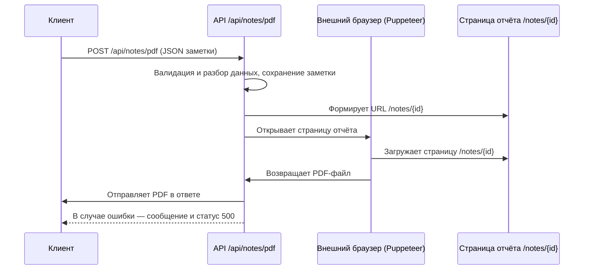

# PDF-сервис заметок и отчётов

Сервис предназначен для подготовки и генерации файлов на основе данных заметки/отчёта.
Поддерживаются два формата вывода:

- PDF-версия заметки
- Markdown-версия заметки

## Как работает сервис

1. **Получение и валидация запроса:**
   Клиент отправляет POST-запрос на один из эндпоинтов API с JSON-объектом заметки (`INote`). Сервис валидирует структуру данных.

2. **Формирование страницы отчёта:**
   Для генерации PDF данные заметки сохраняются и доступны по идентификатору заметки (`id`). На основе `id` формируется URL страницы `/notes/{id}`, которая используется для рендеринга.

3. **Подключение к внешнему браузеру и рендеринг страницы (PDF):**
   Сервис подключается к внешнему экземпляру браузера (через Puppeteer), открывает страницу отчёта `/notes/{id}`, устанавливает параметры печати (A4, без полей, с фоном), дожидается полной загрузки и готовности шрифтов.

4. **Генерация файла:**
   - Для PDF — выполняется печать страницы в PDF с нужными параметрами.
   - Для Markdown — заметка конвертируется в текстовый формат через `noteToMarkdown`.

5. **Возврат файла клиенту:**
   Сформированный файл возвращается клиенту с корректными заголовками для скачивания. В случае ошибки возвращается сообщение об ошибке и статус 500.

## Архитектурная схема (PDF)



## Эндпоинты API

### `POST /api/notes/pdf`

Генерирует PDF-файл заметки.

- **Тело запроса:** JSON-объект заметки (`INote`).
- **Ответ при успехе:**
  - `200 OK`
  - Тело ответа — бинарный PDF-файл.
  - Заголовки:
    - `Content-Type: application/pdf`
    - `Content-Disposition: attachment; filename="note-{id}.pdf"`
- **Ответ при ошибке:**
  - `500 Internal Server Error`
  - Текст: `Error generating PDF: <details>`

#### Пример запроса

```http
POST /api/notes/pdf
Content-Type: application/json

{
  "id": "note-123",
  "title": "Название отчёта",
  "date": "2025-12-01",
  "summary": "Краткое описание",
  "attachments": []
}
```

### `POST /api/notes/markdown`

Генерирует Markdown-представление заметки.

- **Тело запроса:** JSON-объект заметки (`INote`).
- **Ответ при успехе:**
  - `200 OK`
  - Тело ответа — текстовый файл с Markdown-содержимым заметки.
  - Заголовки:
    - `Content-Type: text/plain; charset=utf-8`
    - `Content-Disposition: attachment; filename="note-{id}.md"`
- **Ответ при ошибке:**
  - `500 Internal Server Error`
  - Текст: `Error generating markdown: <details>`

#### Пример запроса

```http
POST /api/notes/markdown
Content-Type: application/json

{
  "id": "note-123",
  "title": "Название отчёта",
  "date": "2025-12-01",
  "summary": "Краткое описание",
  "attachments": []
}
```

## Запуск в режиме разработки

```bash
yarn install
yarn dev
```

Откройте [http://localhost:3000](http://localhost:3000) для проверки работы сервиса.

---
