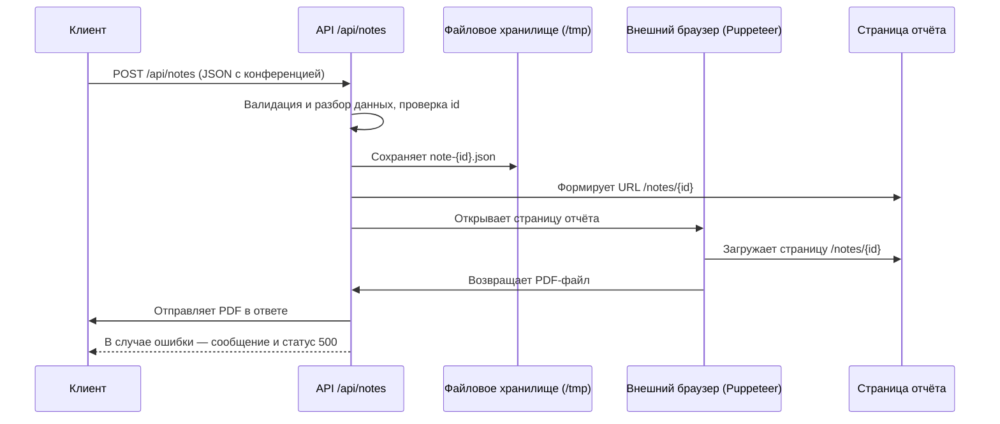

# PDF-сервис отчетов

Сервис предназначен для подготовки и генерации PDF-отчетов по различным событиям и данным.
На данный момент реализована генерация первого типа отчета — **сводка о прошедшей конференции**.

## Как работает сервис

1. **Получение и валидация запроса:**
   Клиент отправляет POST-запрос на эндпоинт `/api/notes` с JSON-объектом конференции, который обязательно должен содержать уникальный идентификатор (`id`). Сервис валидирует структуру данных.

2. **Сохранение данных конференции:**
   Полученные данные сохраняются в виде отдельного JSON-файла во временном файловом хранилище (`/tmp/note-{id}.json`). Это обеспечивает изоляцию и возможность последующего доступа к данным по id.

3. **Формирование URL для рендеринга отчёта:**
   На основе id формируется URL страницы отчёта (`/notes/{id}`), который будет использоваться для генерации PDF.

4. **Подключение к внешнему браузеру и рендеринг страницы:**
   Сервис подключается к внешнему экземпляру браузера (через Puppeteer), открывает страницу отчёта, устанавливает параметры печати (A4, без полей, с фоном), дожидается полной загрузки и готовности шрифтов.

5. **Генерация PDF-документа:**
   После полной загрузки страницы сервис инициирует процесс печати в PDF, формируя итоговый файл с нужными параметрами.

6. **Возврат PDF-файла клиенту:**
   Сформированный PDF возвращается клиенту с корректными заголовками для скачивания. В случае ошибки возвращается сообщение об ошибке и статус 500.

## Архитектурная схема



## Пример запроса

```http
POST /api/report
Content-Type: application/json

{
  "title": "Название конференции",
  "date": "2025-12-01",
  "participants": [...],
  "summary": "Краткое описание",
  ...
}
```

## Запуск в режиме разработки

```bash
npm install
npm run dev
```

Откройте [http://localhost:3000](http://localhost:3000) для проверки работы сервиса.

---
